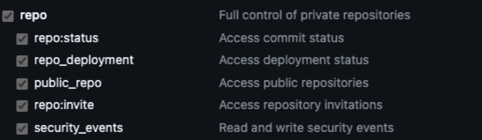
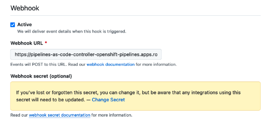
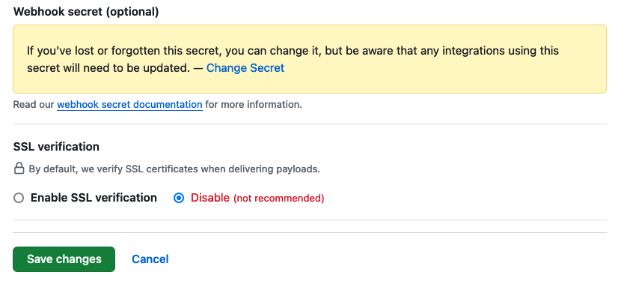

# RHDH Setup Guide For GitHub and GitLab

## Table of Contents

- [GitHub Personal Access Token (PAT)](#github-personal-access-token-pat)
  - [Prerequisites](#prerequisites)
  - [Procedure](#procedure)
- [GitHub App](#github-app)
  - [Procedure](#procedure-1)
  - [App Permissions](#app-permissions)
- [GitLab Personal Access Token (PAT)](#gitlab-personal-access-token-pat)
  - [Prerequisites](#prerequisites-1)
  - [Procedure](#procedure-2)
- [GitLab App](#gitlab-app)
  - [Procedure](#procedure-3)
- [Quay Setup](#quay-setup)
  - [Procedure](#procedure-4)
- [Homepage / Callback / Webhook URLs](#homepage--callback--webhook-urls)
  - [Homepage](#homepage-url)
  - [Callback](#callback-url)
  - [Webhook](#webhook-url)
- [Troubleshooting](#troubleshooting)
  - [Git Resource Not Accessible](#git-resource-not-accessible)
  - [Pipeline Webhook Not Working](#pipeline-webhook-not-working)
  - [Pipeline Failed To Push/Pull Image From Registry](#pipeline-failed-to-pushpull-image-from-registry)
  - [Pipelines Fail To Run For Private Repositories](#pipelines-fail-to-run-for-private-repositories)

## GitHub Personal Access Token (PAT)

### Prerequisites

- A GitHub account.

### Procedure

1. See [creating a personal access token](https://docs.github.com/en/authentication/keeping-your-account-and-data-secure/managing-your-personal-access-tokens#creating-a-personal-access-token-classic) on the GitHub official documentation.
2. For the scopes you should select `repo`, selecting this option will include all scopes within `repo`.



## GitHub App

### Procedure

1. Create a GitHub Organization
2. Follow [Registering a GitHub App](https://docs.github.com/en/apps/creating-github-apps/registering-a-github-app/registering-a-github-app) to create the base of your GitHub App. You can use the default settings unless instructed otherwise.
   1. For `Homepage URL`, `Webhook URL` and `Callback URL` you can put any value as a placeholder as we will deal with these at a later step.
   2. Deselect `Expire user authorization tokens`.
   3. You will need to create a `webhook secret` as part of the App setup process.
3. You should reference [App Permissions](#app-permissions) to set the proper permissions for your GitHub App. This step is crucial in ensuring functionality.
4. After app creation, at the top of the page you will be prompted to create a `private key`. Do this. You also need to generate a `client secret`.
5. In the `Developer Settings` of your newly created GitHub App, navigate to `Install App` and install it to your Organization.

**Note:** It is helpful as part of this step to store the following information somewhere safe:
- GitHub App ID
- Client ID
- Client secret
- Webhook secret
- Private key

### App Permissions

Helpful reading can be found [here](https://backstage.io/docs/integrations/github/github-apps/#app-permissions), however, all required permissions and subscriptions for running AI Software Templates have been compiled below:

#### Repository Permissions
- **Actions** - Read & Write
- **Administration** - Read & Write
- **Contents** - Read & Write
- **Checks** - Read & Write
- **Issues** - Read & Write
- **Metadata** - Read
- **Pull Requests** - Read & Write
- **Workflows** - Read & Write

#### Organization Permissions
- **Members** - Read
- **Plan** - Read

#### Subscribed Events
- Check run
- Check suite
- Issue comment
- Commit comment
- Pull request
- Push

## GitLab Personal Access Token (PAT)

### Prerequisites

- A GitLab account.

### Procedure

- See [create a personal access token](https://docs.gitlab.com/ee/user/profile/personal_access_tokens.html#create-a-personal-access-token).
- Set the following token permissions:
  - `api`
  - `read_repository`
  - `write_repository`

**Note:** Remember to save your PAT somewhere safe.

## GitLab App

### Procedure

1. Create a GitLab App for your GitLab Group.
   1. See [create a group owned application](https://docs.gitlab.com/ee/integration/oauth_provider.html#create-a-group-owned-application).
   2. The `Homepage / Callback / Webhook URLs` can be any value as a placeholder for now.

**Note:** Store your `Application ID` and `Secret` somewhere safe.

## Quay Setup

### Procedure

1. Navigate to your **personal** `quay.io` account and go to `Account Settings -> User Settings -> Docker CLI Password` and hit `Generate Encrypted Password`.
2. Navigate to `Docker Configuration` and grab your `.json` file.
   1. Store this `.json` somewhere safe.
3. Create a Quay Organization and create an App under that Organization.
4. Click into the App and create an OAuth token with `create`, `read`, and `write` access to repositories.
   1. Store this token somewhere safe.

**Note:** The `.json` and token will be used as part of the configuration for RHDH. You can find more information [here](https://github.com/redhat-ai-dev/ai-rhdh-installer/blob/main/README.md#setting-environment-variables-for-configuration-scripts)

## Homepage / Callback / Webhook URLs

### Homepage URL

- This will be the `Route URL` of your RHDH Instance.

### Callback URL

#### GitHub

- `<Homepage URL>/api/auth/github/handler/frame`

#### GitLab

- `<Homepage URL>/api/auth/gitlab/handler/frame`

### Webhook URL

1. Navigate to Openshift Console.
2. Go to the namespace where RHDH is installed.
3. Find the `rhdh-pipelines-secret` Secret and grab the `webhook-url` value.

**Note:** If you installed using our `ai-rhdh-installer` then all of these values will be provided to you in the CLI.

## Troubleshooting

### Git Resource Not Accessible

This error can occur on actions that interact with GitHub or GitLab. In short it lets you know the git repository cannot be created and/or read. You may encounter this error because your GitHub/GitLab App or Git token (PAT) do not have sufficient permissions. You should ensure all permissions are set as described in the [GitHub](#github-app) or [GitLab](#gitlab-app) setup sections.

For GitLab specifically, if your GitLab group is an empty group (i.e. contains no projects) and the user that provisioned the token is shared with a high level group via [group sharing](https://docs.gitlab.com/ee/user/group/manage.html#share-a-group-with-another-group), then you may also have [this issue](https://gitlab.com/gitlab-org/gitlab/-/issues/267996).

**Example:**

```
The backstage GitHub application used in the organization <org-name> does not have access to a repository with the name <repo-name>.
```

### Pipeline Webhook Not Working

You may be encountering this error if after a component has been created in Developer Hub, changes to the component are not triggering the pipelines via webhook. In most cases this error occurs because of insufficient permissions relating to the GitHub/GitLab App or the Git token. 

Ensure your [GitHub App](#github-app) was set up properly or your [GitLab App](#gitlab-app). You are able to view events related to the webhook in your GitHub App by navigating to `Settings -> Developer Settings -> GitHub Apps -> Edit your app -> Advanced`. You will find all recent deliveries contained there.

If you are not using a GitHub App you should follow [these instructions](https://pipelinesascode.com/docs/install/github_webhook/) to ensure your webhook token has sufficient permissions.

If all the above is not fixing your issue you should ensure that your webhook URL (for your GitHub App) is set within the App settings.



If you are using an insecure webhook you will also need to disable SSL verification.



### Pipeline Failed To Push/Pull Image From Registry

This error typically occurs when the pipelines are unable to find the Quay token, however, this can also occur when permissions are insufficient.

**Example:**

```
Error: pushing image "quay.io/jctestorg/test-go-feb2224-1:on-pr-69f52514886c076c9b29ec75022c4f6b4a83994e" to "docker://quay.io/jctestorg/test-go-feb2224-1:on-pr-69f52514886c076c9b29ec75022c4f6b4a83994e": trying to reuse blob sha256:6f740e9430896c5575f685b73a06bae50b08045eefd8d2e96da3f4c6fc104902 at destination: checking whether a blob sha256:6f740e9430896c5575f685b73a06bae50b08045eefd8d2e96da3f4c6fc104902 exists in quay.io/jctestorg/test-go-feb2224-1: authentication required
```

You should make sure that the Quay token has read, write, and create repository permissions. For instructions on how to generate the token and/or obtain the dockerconfigjson, see [here](#quay-setup).

If you installed with the `ai-rhdh-installer` you should also ensure that the Quay Secrets have been properly created in your desired namespace.

### Pipelines Fail To Run For Private Repositories

If you are creating private repositories and are encountering an issue where the pipelines do not run, you should:

1. Create the repository CRs if ArgoCD was unable to sync the resources to the GitOps repository. You can find these under .tekton/ in the GitOps repository.
2. If you are using webhook secrets to configure pipelines (such as on GitLab), you also need to ensure that the following fields are set in the repository CR.

```
git_provider:
  secret:
    name: "github-webhook-config"
```

```
webhook_secret:
  name: "github-webhook-config"
```