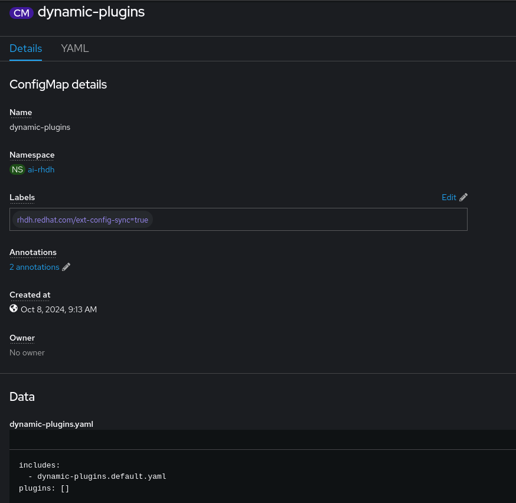
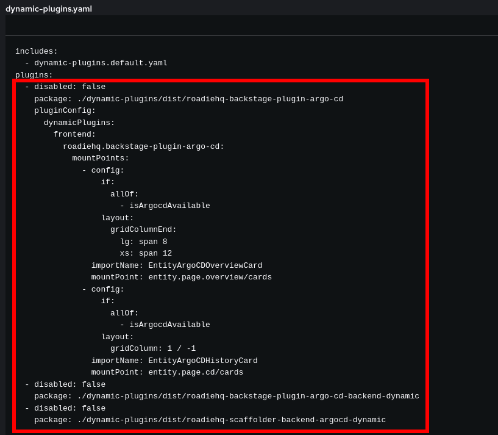

## GitOps/ArgoCD Configuration

As part of this section you will find information about the following configuration methods:

1. [Configuring GitOps/ArgoCD with the configuration script after using our `ai-rhdh-installer`](#ai-rhdh-installer-script-configuration)
2. [Configuring GitOps/ArgoCD manually after using our `ai-rhdh-installer`](#ai-rhdh-installer-manual-configuration)
3. [Configuring GitOps/ArgoCD with the configuration script for a pre-existing ArgoCD and Red Hat Developer Hub instance](#pre-existing-instance-script-configuration)
4. [Configuring GitOps/ArgoCD manually for a pre-existing ArgoCD and Red Hat Developer Hub instance](#pre-existing-instance-manual-configuration)

### Prerequisites
<!---
TODO: Once RHDH configuration is complete we should link a reference to it here.
-->
- In order to allow the configuration to be completed you must first have a working Red Hat Developer Hub (RHDH) instance (for example you are able to login and view Developer Hub).
- [yq](https://github.com/mikefarah/yq/) version 4.0+.

### AI-RHDH-Installer: Script Configuration
If you installed using the [`ai-rhdh-installer`](../README.md#install) all that is required for hooking up the ArgoCD instance to your RHDH instance is to run `bash ./scripts/configure-gitops.sh`. Please note if you changed the installation namespace used by the installer you will first need to run `export NAMESPACE=<namespace used>` as the default value is `ai-rhdh`.

### AI-RHDH-Installer: Manual Configuration

#### Step 1: ConfigMaps and Secrets
In your chosen namespace you should apply the `argocd-config` ConfigMap under [`argocd-config.yaml` ](../resources/argocd-config.yaml).

As part of the `ai-rhdh-installer` a secret was created in your desired namespace with the name `rhdh-argocd-secret`, keep note of this Secret as well as the two ConfigMaps applied above.

#### Step 2.1: Updating Plugins Via Web Console
**Note: RHDH will encounter errors if the ArgoCD plugins are loaded before an instance is properly attached - This step may result in errors until all steps are completed**

To include the [ArgoCD plugins list](../dynamic-plugins/argocd-plugins.yaml) we need to edit the dynamic plugins ConfigMap that was created by the RHDH Operator:



Edit the associated `yaml` file to include the contents of the [ArgoCD plugins list](../dynamic-plugins/argocd-plugins.yaml) under the `plugins` section:



#### Step 2.2: Updating Plugins with the CLI

Alternatively, we can use this series of commands to perform the same task with `kubectl` and `yq` using the [`argocd-plugins.yaml`](../dynamic-plugins/argocd-plugins.yaml):

1. Fetch the dynamic plugins ConfigMap and save the `dynamic-plugins.yaml` content within to a temp file
    ```sh
    kubectl get configmap backstage-dynamic-plugins-ai-rh-developer-hub -n ai-rhdh -o yaml | yq '.data["dynamic-plugins.yaml"]' > temp-dynamic-plugins.yaml
    ```
2. Merge the contents of [`argocd-plugins.yaml`](../dynamic-plugins/argocd-plugins.yaml) into the temp file
    ```sh
    yq -i ".plugins += $(yq '.plugins' ./dynamic-plugins/argocd-plugins.yaml -M -o json) | .plugins |= unique_by(.package)" temp-dynamic-plugins.yaml
    ```
3. Patch the dynamic plugins ConfigMap with the updated content in the temp file
    ```sh
    kubectl patch configmap backstage-dynamic-plugins-ai-rh-developer-hub -n ai-rhdh \
    --type='merge' \
    -p="{\"data\":{\"dynamic-plugins.yaml\":\"$(echo "$(cat temp-dynamic-plugins.yaml)" | sed 's/"/\\"/g' | sed 's/$/\\n/g' | tr -d '\n')\"}}"
    ```
4. Dynamic plugins should be updated to include the [ArgoCD plugins list](../dynamic-plugins/argocd-plugins.yaml) with a pod update triggered and you may remove the temp file at this point

#### Step 3: Updating RHDH Deployment
Now that all of the required ConfigMaps and Secrets are part of the namespace, we must edit the RHDH Deployment to properly reference these items.

We will need to add the `argocd-config.yaml` as a `VolumeMount` to the `containers` field in the RHDH Deployment under `.spec.template.spec.containers.volumeMounts`


Next add the created `rhdh-argocd-secret` to the `envFrom` field in the RHDH Deployment under `.spec.template.spec.containers.envFrom`


Now we must update the config args used by RHDH to include our ArgoCD ConfigMap. This is added to the `args` field in the RHDH Deployment under `.spec.template.spec.containers.args`


Finally we need to add the resources included as `volumeMounts` to the `volumes` field in the RHDH Deployment under `.spec.template.spec.volumes`


### Pre-Existing Instance: Script Configuration
If you have your own ArgoCD instance created you can configure it to work with RHDH with the use of our config script. You will need the following information on hand:

1. Namespace of RHDH & ArgoCD instance
2. Deployment name of RHDH
3. ConfigMap name for your RHDH plugins
   1. Typically `dynamic-plugins` for `Helm` installs and `backstage-dynamic-plugins-<name of developer hub instance>` for `Operator` installs
4. ArgoCD user with token permissions
5. Password for ArgoCD user
6. ArgoCD hostname
   1. Typically `.spec.host` of the `route` for ArgoCD
7. Token associatd with the ArgoCD user

You are able to store these values in environment variables or paste them during the interactive prompts at runtime. Set the following the use environment variables:
- `$EXISTING_NAMESPACE`
- `$EXISTING_DEPLOYMENT`
- `$RHDH_PLUGINS`
- `$ARGO_USERNAME`
- `$ARGO_PASSWORD`
- `$ARGO_HOSTNAME`
- `$ARGO_TOKEN`
- `$ARGO_INSTANCE_NAME`

Once you have that information readily available you can follow:

1. Run `export ARGOCD_INSTANCE_PROVIDED=true`
2. Run `bash ./scripts/configure-gitops.sh` and follow the prompts in the command line

### Pre-Existing Instance: Manual Configuration

#### Step 1: Required Information
You will need the following information on hand to properly configure an existing ArgoCD instance with RHDH:

- ArgoCD User (with permissions for creating tokens)
- Password for the user
- ArgoCD hostname
  - Typically found under `.spec.host` for your ArgoCD `route`
- Token

#### Step 2: ConfigMaps and Secrets
In your chosen namespace you should apply the `argocd-config` ConfigMap under [`argocd-config.yaml` ](../resources/argocd-config.yaml).

You will also need to create a Secret in your chosen namespace with the following key:value pairs and information gathered in [step 1](#step-1-required-information):
1. `ARGOCD_USER`
2. `ARGOCD_PASSWORD`
3. `ARGOCD_HOSTNAME`
4. `ARGOCD_API_TOKEN`

#### Step 3: Updating Plugins
Follow the same steps as [step 2 for the ai-rhdh-installer](#step-2-updating-plugins).

#### Step 4: Updating RHDH Deployment
Once you have applied the ConfigMaps and Secrets to your cluster and the chosen namespace you can now follow the same steps in [step 3 for the ai-rhdh-installer](#step-3-updating-rhdh-deployment). Every step will be identical if your RHDH instance was created using the `Red Hat Developer Hub Operator`, however, if you installed RHDH using the `Helm Chart` you may find that `.spec.template.spec.containers.envFrom` does not exist in the Deployment yaml. If this is the case you can simply add `envFrom` field yourself and the reference to the `rhdh-argocd-secret` secret.

Additionally, if RHDH was installed with `Helm` the naming for the RHDH Deployment and ConfigMap (for the dynamic plugins) may differ than the example but the content will look similar so you can reference that to find the proper files.