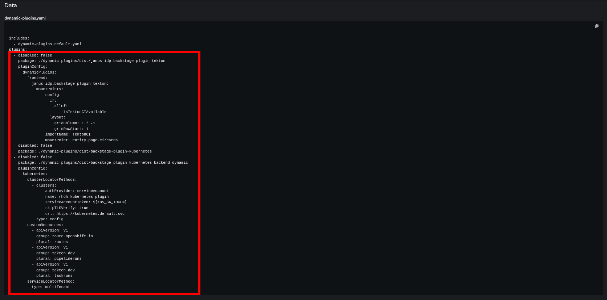

## Pipelines/Tekton Configuration

As part of this section you will find information about the following configuration methods:

1. [Configuring Pipelines/Tekton with the configuration script after using our `ai-rhdh-installer`](#ai-rhdh-installer-script-configuration)
2. [Configuring Pipelines/Tekton manually after using our `ai-rhdh-installer`](#ai-rhdh-installer-manual-configuration)
3. [Configuring Pipelines/Tekton with the configuration script for a pre-existing Red Hat Developer Hub instance](#pre-existing-instance-script-configuration)
4. [Configuring Pipelines/Tekton manually for a pre-existing Red Hat Developer Hub instance](#pre-existing-instance-manual-configuration)

### Prerequisites

- [yq](https://github.com/mikefarah/yq/) version 4.0+.
- [kubectl](https://github.com/kubernetes/kubectl) version compatible with your target cluster

### AI-RHDH-Installer: Script Configuration
If you installed using the [`ai-rhdh-installer`](../README.md#install) all that is required for hooking up the Pipelines services and Tekton to your RHDH instance is to run `bash ./scripts/configure-pipelines.sh`. Please note if you changed the installation namespace used by the installer you will first need to run `export NAMESPACE=<namespace used>` as the default value is `ai-rhdh`.

### AI-RHDH-Installer: Manual Configuration

#### Step 1: TektonConfig CR
You should patch the `TektonConfig` CR called `config` with the extended configuration under [`tekton-config.json`](../resources/tekton-config.json)
to setup Tekton for AI software template use and RHDH integration.

Before patching you will need to provide an additional field `transparency.url` under `chain` to point to the rekor server as follows:
```json
{
    "spec": {
        ...
        "chain": {
            ...
            "transparency.url": "http://rekor-server.<rhdh_namespace>.svc"
        },
        ...
    }
}
```

#### Step 2: RHDH kubernetes plugin service account

As part of the `ai-rhdh-installer` a service account with a token secret was created in your desired namespace with the name `rhdh-kubernetes-plugin`, token secret should have a name pattern `rhdh-kubernetes-plugin-token-*`, keep note of this Secret.

#### Step 3: Setting up deployment namespaces

You will need to create the namespaces for the different app deployments. With a target namespace called `ai-rhdh`, these namespaces would be called `ai-rhdh-app-development`, `ai-rhdh-app-stage`, and `ai-rhdh-app-prod`. These namespaces can be created using the following:

```sh
APP_NAMESPACE=$NAMESPACE-app-<developer|stage|prod>
cat <<EOF | kubectl apply -f - >/dev/null
apiVersion: v1
kind: Namespace
metadata:
  labels:
    argocd.argoproj.io/managed-by: $NAMESPACE
  name: $APP_NAMESPACE
EOF
```

#### Step 4: Setting up cosign secret under deployment namespaces

First you will need to fetch the cosign public key from the `signing-secrets` secret in the `openshift-pipelines` namespace that was setup by the installer:

```sh
kubectl get secrets -n openshift-pipelines signing-secrets -o jsonpath='{.data.cosign\.pub}' 2>/dev/null
```

Take note of the public key, then use it to create the cosign secret under each of the deployment namespaces:

```sh
cat <<EOF | kubectl apply -f - >/dev/null
apiVersion: v1
data:
    cosign.pub: <cosign_public_key>
kind: Secret
metadata:
    labels:
        app.kubernetes.io/instance: default
        app.kubernetes.io/part-of: tekton-chains
        operator.tekton.dev/operand-name: tektoncd-chains
    name: cosign-pub
    namespace: $APP_NAMESPACE
type: Opaque
EOF
```

#### Step 5: Setting up gitops authentication secret under deployment namespaces

If you are using GitLab, you will need to create the GitLab authentication secret with your GitLab PAT as follows:

```sh
kubectl -n $APP_NAMESPACE create secret generic "gitlab-auth-secret" \
    --from-literal=password=<gitlab_pat> \
    --from-literal=username=oauth2 \
    --type=kubernetes.io/basic-auth \
    --dry-run=client -o yaml | kubectl -n $APP_NAMESPACE apply --filename - --overwrite=true >/dev/null
```

Otherwise, you will need to create a Git authentication secret with your PAT (e.g. GitHub PAT) as follows:

```sh
kubectl -n $APP_NAMESPACE create secret generic "gitops-auth-secret" \
    --from-literal=password=<git_pat> \
    --type=kubernetes.io/basic-auth \
    --dry-run=client -o yaml | kubectl -n $APP_NAMESPACE apply --filename - --overwrite=true >/dev/null
```

#### Step 6: Setting up pipelines secret under deployment namespaces

You will need to create a pipeline secret containing the webhook secret for the Git organization for deployments to have proper access via the tekton pipelines:

```sh
kubectl -n $APP_NAMESPACE create secret generic "pipelines-secret" \
    --from-literal=webhook.secret=<webhook_secret> \
    --dry-run=client -o yaml | kubectl -n $APP_NAMESPACE apply --filename - --overwrite=true >/dev/null
```

#### Step 7: Setting up quay image registry secret under deployment namespaces

For accessing the quay image registry, you'll need to create a secret
to store the docker config json file:

```sh
kubectl -n $APP_NAMESPACE create secret docker-registry "rhdh-image-registry-token" \
    --from-file=.dockerconfigjson="<dockerconfig_jsonfile>" --dry-run=client -o yaml | \
    kubectl -n $APP_NAMESPACE apply --filename - --overwrite=true >/dev/null
```

Then for both the `default` and `pipeline` service accounts under the deployment namespace, you will need to tie in the image registry secret you just created:

```sh
kubectl -n $APP_NAMESPACE patch serviceaccounts "<default|pipeline>" --patch "
secrets:
- name: rhdh-image-registry-token
imagePullSecrets:
- name: rhdh-image-registry-token
" >/dev/null
```

#### Step 8.1: Updating Plugins Via Web Console

To include the [Tekton plugins list](../dynamic-plugins/tekton-plugins.yaml) we need to edit the dynamic plugins ConfigMap that was created by the RHDH Operator:


Edit the associated `yaml` file to include the contents of the [Tekton plugins list](../dynamic-plugins/tekton-plugins.yaml) under the `plugins` section:



#### Step 8.2: Updating Plugins with the CLI

Alternatively, we can use this series of commands to perform the same task with `kubectl` and `yq` using the [`tekton-plugins.yaml`](../dynamic-plugins/tekton-plugins.yaml):

1. Fetch the dynamic plugins ConfigMap and save the `dynamic-plugins.yaml` content within to a temp file
    ```sh
    kubectl get configmap backstage-dynamic-plugins-ai-rh-developer-hub -n ai-rhdh -o yaml | yq '.data["dynamic-plugins.yaml"]' > temp-dynamic-plugins.yaml
    ```
2. Merge the contents of [`tekton-plugins.yaml`](../dynamic-plugins/tekton-plugins.yaml) into the temp file
    ```sh
    yq -i ".plugins += $(yq '.plugins' ./dynamic-plugins/tekton-plugins.yaml -M -o json) | .plugins |= unique_by(.package)" temp-dynamic-plugins.yaml
    ```
3. Patch the dynamic plugins ConfigMap with the updated content in the temp file
    ```sh
    kubectl patch configmap backstage-dynamic-plugins-ai-rh-developer-hub -n ai-rhdh \
    --type='merge' \
    -p="{\"data\":{\"dynamic-plugins.yaml\":\"$(echo "$(cat temp-dynamic-plugins.yaml)" | sed 's/"/\\"/g' | sed 's/$/\\n/g' | tr -d '\n')\"}}"
    ```
4. Dynamic plugins should be updated with the [Tekton plugins list](../dynamic-plugins/tekton-plugins.yaml) with a pod update triggered and you may remove the temp file at this point

#### Step 9: Updating RHDH Deployment

We need to map the referenced environment variable `K8S_SA_TOKEN` to the `rhdh-kubernetes-plugin` service account token secret.

We can get the name of the service account tied token secret with the following command:

```sh
kubectl get secrets -n "<rhdh_namespace>" -o name | grep rhdh-kubernetes-plugin-token- | cut -d/ -f2 | head -1
```

Using the returned name from the command above, we can bind this secret to the `K8S_SA_TOKEN` under `.spec.template.spec.containers.env`


### Pre-Existing Instance: Script Configuration

#### Step 1: Required Information

If you have your own RHDH instance created you can configure it to work with the pipelines service with the use of our config script. You will need the following information on hand:

1. Namespace of RHDH instance
2. Deployment name of RHDH
3. ConfigMap name for your RHDH plugins
   1. Typically `dynamic-plugins` for `Helm` installs and `backstage-dynamic-plugins-<name of developer hub instance>` for `Operator` installs
4. Kubernetes API service account

#### Step 2: Environment Variables

You are able to store these values in environment variables or paste them during the interactive prompts at runtime. Set the following the use environment variables:
- `$EXISTING_NAMESPACE`
  - Name of target RHDH namespace
- `$EXISTING_DEPLOYMENT`
  - Name of target RHDH deployment
- `$RHDH_PLUGINS`
  - Name of the dynamic plugins ConfigMap

#### Step 3: Configure cosign

The installer will configure and set up cosign that the `configure-pipeline.sh` script needs to reference the cosign public key to set to the cosign secret under the deployment namespaces.

To configure cosign to sign secrets follow these steps:
1. Download `cosign` cli tool
    ```sh
    curl -L https://github.com/sigstore/cosign/releases/latest/download/cosign-linux-amd64 -o cosign && chmod +x cosign
    ```
2. Delete the default secret if it exists
    ```sh
    kubectl delete secrets -n "openshift-pipelines" "signing-secrets" --ignore-not-found=true
    ```
3. Create a random password
    ```sh
    RANDOM_PASS=$( openssl rand -base64 30 )
    ```
4. Generate the key pair secret directly in the cluster, the secret should be created as immutable
    ```sh
    env COSIGN_PASSWORD=$RANDOM_PASS ./cosign generate-key-pair "k8s://openshift-pipelines/signing-secrets" >/dev/null
    ```
5. If the secret is not marked as immutable, make it so
    ```sh
    kubectl patch secret -n "openshift-pipelines" "signing-secrets" \
        --dry-run=client -o yaml \
        --patch='{"immutable": true}' \
        | kubectl apply -f - >/dev/null
    ````


#### Step 4: Run configure script

Once you have done the prior steps and have the information from the prior steps readily available you can follow:

1. Run `export RHDH_INSTANCE_PROVIDED=true`
2. Run `bash ./scripts/configure-pipelines.sh` and follow the prompts in the command line

### Pre-Existing Instance: Manual Configuration

#### Step 1: Configure cosign

You will follow the same steps as [step 3 of the script configuration for a pre-existing instance](#step-3-configure-cosign).

#### Step 2: Kubernetes API Service Account
First you will need to create the [service account](../chart/templates/k8s-serviceaccount.yaml)
that RHDH will need to interact with the cluster such as
creating tekton pipeline runs.

Once the service account is created there will be a tied secret which stores the service account token, e.g. if a service account `rhdh-kubernetes-plugin` is created then a secret with the name pattern `rhdh-kubernetes-plugin-token-*` is also created.

Keep note of the name of this secret.

#### Step 3: Setting up deployment namespaces

You will follow the following same steps for setting up the deployment namespaces with the ai-rhdh-installer:

1. [Setting up deployment namespaces](#step-3-setting-up-deployment-namespaces)
2. [Setting up cosign secret under deployment namespaces](#step-4-setting-up-cosign-secret-under-deployment-namespaces)
3. [Setting up gitops authentication secret under deployment namespaces](#step-5-setting-up-gitops-authentication-secret-under-deployment-namespaces)
4. [Setting up gitops authentication secret under deployment namespaces](#step-5-setting-up-gitops-authentication-secret-under-deployment-namespaces)
5. [Setting up pipelines secret under deployment namespaces](#step-6-setting-up-pipelines-secret-under-deployment-namespaces)
6. [Setting up quay image registry secret under deployment namespaces](#step-7-setting-up-quay-image-registry-secret-under-deployment-namespaces)

#### Step 4: Updating Plugins
You will follow the same steps as [step 8 for the ai-rhdh-installer](#step-8-updating-plugins).

#### Step 5: Updating RHDH Deployment
Once you have applied the Secrets and patched the ConfigMaps in your cluster and the necessary namespace you can now follow the same steps in [step 9 for the ai-rhdh-installer](#step-9-updating-rhdh-deployment).
