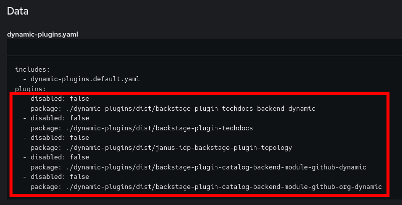

## Installer Provisioned Red Hat Developer Hub Configuration

This document covers the configuration of an OpenShift Red Hat Developer Hub Operator after the Operator was installed using our [`ai-rhdh-installer`](../../README.md#helm-chart-installer) Helm chart.

### Prerequisites

- Performed steps under both [GitOps/ArgoCD Configuration](../GITOPS-CONFIG.md) and [Pipelines/Tekton Configuration](../PIPELINES-CONFIG.md)

### Script Configuration

Run `bash ./scripts/configure-dh.sh` from the root of this repository to start the configuration process using our configuration scripts. Please note if you changed the installation namespace used by the installer you first need to run `export NAMESPACE=<namespace-used>` as the default value is `ai-rhdh`.

For GitHub integration, run:
```
export RHDH_GITHUB_INTEGRATION=true
```

For GitLab integration, run:
```
export RHDH_GITLAB_INTEGRATION=true
```

**Note:** If both GitHub and GitLab integrations are enabled, you will be prompted to choose *one*.

### Manual Configuration

If you wish to manually do the configuration after installing the Operators with the installer, you should have the following resources ready for use:

- [`secret/ai-rh-developer-hub-env`](../../chart/templates/developer-hub/includes/_extra-env.tpl) 
  - A Secret which stores all the developer hub private variables
- [`configmap/developer-hub-base-app-config`](../../chart/templates/developer-hub/includes/_appconfig.tpl) 
  - A ConfigMap that contains the base config for developer hub, such as the site url fields
- [`configmap/dynamic-plugins`](../../chart/templates/developer-hub/includes/_plugins.tpl) 
  - A ConfigMap that contains the list of enabled plugins for developer hub to install and use
- [`backstage/ai-rh-developer-hub`](../../chart/templates/developer-hub/includes/_backstage.tpl) 
  - A CR for controlling the developer hub deployment

#### Step 1: Patch the Extra Environment Variables Secret

You will need to patch the `ai-rh-developer-hub-env` Secret to set the private environment variables for RHDH. This can be done one of the following ways, depending on your login method:

**GitHub**

```sh
kubectl -n $NAMESPACE patch secret ai-rh-developer-hub-env \
    --type 'merge' \
    -p="{\"data\": {\"GITHUB__APP__ID\": \"$(echo '<github_app_id>' | base64)\",
    \"GITHUB__APP__CLIENT__ID\": \"$(echo '<github_app_client_id>' | base64)\",
    \"GITHUB__APP__CLIENT__SECRET\": \"$(echo '<github_app_client_secret>' | base64)\",
    \"GITHUB__APP__WEBHOOK__URL\": \"$(echo '<github_app_webhook_url>' | base64)\",
    \"GITHUB__APP__WEBHOOK__SECRET\": \"$(echo '<github_app_webhook_secret>' | base64)\",
    \"GITHUB__APP__PRIVATE_KEY\": \"$(base64 '</path/to/app/pk>')\",
    \"GITHUB_ORGANIZATION\": \"$(echo '<github_org_name>' | base64)\",
    \"GITOPS__GIT_TOKEN\": \"$(echo '<git_pat>' | base64)\"}}"
```

**GitLab**

```sh
kubectl -n $NAMESPACE patch secret ai-rh-developer-hub-env \
    --type 'merge' \
    -p="{\"data\": {\"GITLAB__APP__CLIENT__ID\": \"$(echo '<gitlab_app_client_id>' | base64)\",
    \"GITLAB__APP__CLIENT__SECRET\": \"$(echo '<gitlab_app_client_secret>' | base64)\",
    \"GITLAB__TOKEN\": \"$(echo '<gitlab_pat>' | base64)\"}}"
```

**Both**

```sh
kubectl -n $NAMESPACE patch secret ai-rh-developer-hub-env \
    --type 'merge' \
    -p="{\"data\": {\"GITHUB__APP__ID\": \"$(echo '<github_app_id>' | base64)\",
    \"GITHUB__APP__CLIENT__ID\": \"$(echo '<github_app_client_id>' | base64)\",
    \"GITHUB__APP__CLIENT__SECRET\": \"$(echo '<github_app_client_secret>' | base64)\",
    \"GITHUB__APP__WEBHOOK__URL\": \"$(echo '<github_app_webhook_url>' | base64)\",
    \"GITHUB__APP__WEBHOOK__SECRET\": \"$(echo '<github_app_webhook_secret>' | base64)\",
    \"GITHUB__APP__PRIVATE_KEY\": \"$(base64 '</path/to/app/pk>')\",
    \"GITHUB_ORGANIZATION\": \"$(echo '<github_org_name>' | base64)\",
    \"GITOPS__GIT_TOKEN\": \"$(echo '<git_pat>' | base64)\",
    \"GITLAB__APP__CLIENT__ID\": \"$(echo '<gitlab_app_client_id>' | base64)\",
    \"GITLAB__APP__CLIENT__SECRET\": \"$(echo '<gitlab_app_client_secret>' | base64)\",
    \"GITLAB__TOKEN\": \"$(echo '<gitlab_pat>' | base64)\"}}""
```

#### Step 2: Create the Extra App Config ConfigMap

The base app config only contains what is needed to run Developer Hub at a workable default setting state. To customize Developer Hub for our purposes, we will create a ConfigMap to facilitate extra app configuration for the Developer Hub instance. 

The starting point of this app config is contained within [developer-hub-app-config.yaml](../../resources/developer-hub-app-config.yaml), this will be customized below depending on the desired integration.

##### Step 2.1: GitHub Integration

For enabling GitHub catalog for provisioning users and resources you will need to add the following under `.catalog` within the app config:

```yaml
providers:
  github:
    providerId:
      organization: ${GITHUB_ORGANIZATION}
      schedule:
        frequency:
          minutes: 30
        initialDelay:
          seconds: 15
        timeout:
          minutes: 15
  githubOrg:
    githubUrl: https://github.com
    orgs: [ "${GITHUB_ORGANIZATION}" ]
    schedule:
      frequency:
        minutes: 30
      initialDelay:
        seconds: 15
      timeout:
        minutes: 15
```

For enabling GitHub for authentication you will need to add the following under `.auth` within the app config:

```yaml
providers:
  github:
    production:
      clientId: ${GITHUB__APP__CLIENT__ID}
      clientSecret: ${GITHUB__APP__CLIENT__SECRET}
```

For enabling GitHub integration you will need to add the following under the root of the app config:

```yaml
integrations:
  github:
    - host: github.com
      apps:
        - appId: ${GITHUB__APP__ID}
          clientId: ${GITHUB__APP__CLIENT__ID}
          clientSecret: ${GITHUB__APP__CLIENT__SECRET}
          webhookUrl: ${GITHUB__APP__WEBHOOK__URL}
          webhookSecret: ${GITHUB__APP__WEBHOOK__SECRET}
          privateKey: ${GITHUB__APP__PRIVATE_KEY}
```

When you are ready to apply changes run the following command:

```sh
kubectl -n $NAMESPACE apply -f resources/developer-hub-app-config.yaml
```

##### Step 2.2: GitLab Integration

For enabling GitLab for authentication you will need to add the following under `.auth` within the app config:

```yaml
providers:
  gitlab:
    production:
      clientId: ${GITLAB__APP__CLIENT__ID}
      clientSecret: ${GITLAB__APP__CLIENT__SECRET}
```

For enabling GitLab integration you will need to add the following under the root of the app config:

```yaml
integrations:
  gitlab:
    - host: github.com
      token: ${GITLAB__TOKEN}
```

When you are ready to apply changes run the following command:

```sh
kubectl -n $NAMESPACE apply -f resources/developer-hub-app-config.yaml
```

#### Step 3: Setting the Extra App Config to Developer Hub

Now that the extra app config ConfigMap has been created, the Developer Hub instance needs to use it. This is accomplished by patching the app config into the deployment's `Backstage` CR:

```sh
kubectl -n $NAMESPACE get backstage ai-rh-developer-hub -o yaml | \
        yq '.spec.application.appConfig.configMaps += [{"name": "developer-hub-app-config"}] | 
            .spec.application.appConfig.configMaps |= unique_by(.name)' -M -I=0 -o=json | \
        kubectl apply -n $NAMESPACE -f -
```

#### Step 4.1: Updating ArgoCD Plugins Via Web Console
**Note:** RHDH will encounter errors if the ArgoCD plugins are loaded before an instance is properly attached. This step may result in errors until all steps are completed.

To include the [ArgoCD plugins list](../../dynamic-plugins/argocd-plugins.yaml) we need to edit the dynamic plugins ConfigMap that is attached to the RHDH instance:


Edit the associated `yaml` file to include the contents of the [ArgoCD plugins list](../../dynamic-plugins/argocd-plugins.yaml) under the `plugins` section:


#### Step 4.2: Updating ArgoCD Plugins Via CLI

Alternatively, we can use this series of commands to perform the same task with `kubectl` and `yq` using the [`argocd-plugins.yaml`](../../dynamic-plugins/argocd-plugins.yaml):

1. Fetch the dynamic plugins ConfigMap and save the `dynamic-plugins.yaml` content within to a temp file
    ```sh
    kubectl get configmap dynamic-plugins -n $NAMESPACE -o yaml | yq '.data["dynamic-plugins.yaml"]' > temp-dynamic-plugins.yaml
    ```
2. Merge the contents of [`argocd-plugins.yaml`](../../dynamic-plugins/argocd-plugins.yaml) into the temp file
    ```sh
    yq -i ".plugins += $(yq '.plugins' ./dynamic-plugins/argocd-plugins.yaml -M -o json) | .plugins |= unique_by(.package)" temp-dynamic-plugins.yaml
    ```
3. Patch the dynamic plugins ConfigMap with the updated content in the temp file
    ```sh
    kubectl patch configmap dynamic-plugins -n $NAMESPACE \
    --type='merge' \
    -p="{\"data\":{\"dynamic-plugins.yaml\":\"$(echo "$(cat temp-dynamic-plugins.yaml)" | sed 's/"/\\"/g' | sed 's/$/\\n/g' | tr -d '\n')\"}}"
    ```
4. A pod update should have been triggered at this point that will update the dynamic plugins to include the [ArgoCD plugins list](../../dynamic-plugins/argocd-plugins.yaml). You may remove the temp file at this point

#### Step 5.1: Updating Tekton Plugins Via Web Console

To include the [Tekton plugins list](../../dynamic-plugins/tekton-plugins.yaml) we need to edit the dynamic plugins ConfigMap that is attached to the RHDH instance:


Edit the associated `yaml` file to include the contents of the [Tekton plugins list](../../dynamic-plugins/tekton-plugins.yaml) under the `plugins` section:


#### Step 5.2: Updating Tekton Plugins Via CLI

Alternatively, we can use this series of commands to perform the same task with `kubectl` and `yq` using the [`tekton-plugins.yaml`](../../dynamic-plugins/tekton-plugins.yaml):

1. Fetch the dynamic plugins ConfigMap and save the `dynamic-plugins.yaml` content within to a temp file
    ```sh
    kubectl get configmap dynamic-plugins -n $NAMESPACE -o yaml | yq '.data["dynamic-plugins.yaml"]' > temp-dynamic-plugins.yaml
    ```
2. Merge the contents of [`tekton-plugins.yaml`](../../dynamic-plugins/tekton-plugins.yaml) into the temp file
    ```sh
    yq -i ".plugins += $(yq '.plugins' ./dynamic-plugins/tekton-plugins.yaml -M -o json) | .plugins |= unique_by(.package)" temp-dynamic-plugins.yaml
    ```
3. Patch the dynamic plugins ConfigMap with the updated content in the temp file
    ```sh
    kubectl patch configmap dynamic-plugins -n $NAMESPACE \
    --type='merge' \
    -p="{\"data\":{\"dynamic-plugins.yaml\":\"$(echo "$(cat temp-dynamic-plugins.yaml)" | sed 's/"/\\"/g' | sed 's/$/\\n/g' | tr -d '\n')\"}}"
    ```
4. A pod update should have been triggered at this point that will update the dynamic plugins to include the [Tekton plugins list](../../dynamic-plugins/tekton-plugins.yaml). You may remove the temp file at this point

#### Step 6.1: Updating Developer Hub Plugins Via Web Console

To include the [Developer Hub plugins list](../../dynamic-plugins/dh-plugins.yaml) we need to edit the dynamic plugins ConfigMap that is attached to the RHDH instance:


Edit the associated `yaml` file to include the contents of the [Developer Hub plugins list](../../dynamic-plugins/dh-plugins.yaml) under the `plugins` section:



#### Step 6.2: Updating Developer Hub Plugins Via CLI

Alternatively, we can use this series of commands to perform the same task with `kubectl` and `yq` using the [`dh-plugins.yaml`](../../dynamic-plugins/dh-plugins.yaml):

1. Fetch the dynamic plugins ConfigMap and save the `dynamic-plugins.yaml` content within to a temp file
    ```sh
    kubectl get configmap dynamic-plugins -n $NAMESPACE -o yaml | yq '.data["dynamic-plugins.yaml"]' > temp-dynamic-plugins.yaml
    ```
2. Merge the contents of [`dh-plugins.yaml`](../../dynamic-plugins/dh-plugins.yaml) into the temp file
    ```sh
    yq -i ".plugins += $(yq '.plugins' ./dynamic-plugins/dh-plugins.yaml -M -o json) | .plugins |= unique_by(.package)" temp-dynamic-plugins.yaml
    ```
3. Patch the dynamic plugins ConfigMap with the updated content in the temp file
    ```sh
    kubectl patch configmap dynamic-plugins -n $NAMESPACE \
    --type='merge' \
    -p="{\"data\":{\"dynamic-plugins.yaml\":\"$(echo "$(cat temp-dynamic-plugins.yaml)" | sed 's/"/\\"/g' | sed 's/$/\\n/g' | tr -d '\n')\"}}"
    ```
4. A pod update should have been triggered at this point that will update the dynamic plugins to include the [Developer Hub plugins list](../../dynamic-plugins/dh-plugins.yaml). You may remove the temp file at this point

#### Step 7: Updating RHDH Deployment

Now you will need to make sure that all of the ArgoCD and Tekton tied resources are setup with the Developer Hub deployment.

##### Step 7.1: Patch Kubernetes Service Account Token

Run the following to patch in the Kubernetes Service Account Token that is needed for use under the Kubernetes dynamic plugin:

```sh
K8S_SA_SECRET_NAME=$(kubectl get secrets -n "$NAMESPACE" -o name | grep rhdh-kubernetes-plugin-token- | cut -d/ -f2 | head -1)
K8S_SA_TOKEN=$(kubectl -n $NAMESPACE get secret $K8S_SA_SECRET_NAME -o yaml | yq '.data.token' -M -I=0)
kubectl -n $NAMESPACE patch secret ai-rh-developer-hub-env \
    --type 'merge' \
    -p="{\"data\": {\"K8S_SA_TOKEN\": \"${K8S_SA_TOKEN}\"}}"
```

Notice that `K8S_SA_TOKEN` does not need encoding as the other literal sets, this is because when the value is fetched from the Service Account Token Secret it comes back already encoded.

##### Step 7.2: ArgoCD Config and Secret

Run the following to attach the ArgoCD ConfigMap and Secret:

```sh
kubectl -n $NAMESPACE get backstage ai-rh-developer-hub -o yaml | \
        yq '.spec.application.appConfig.configMaps += [{"name": "argocd-config"}] | 
            .spec.application.appConfig.configMaps |= unique_by(.name) |
            .spec.application.extraEnvs.secrets += [{"name": "rhdh-argocd-secret"}] | 
            .spec.application.extraEnvs.secrets |= unique_by(.name)' -M -I=0 -o=json | \
        kubectl apply -n $NAMESPACE -f -
```

See [GitOps/ArgoCD Configuration](GITOPS-CONFIG.md#ai-rhdh-installer-manual-configuration) for information on creating the ArgoCD ConfigMap and Secret.